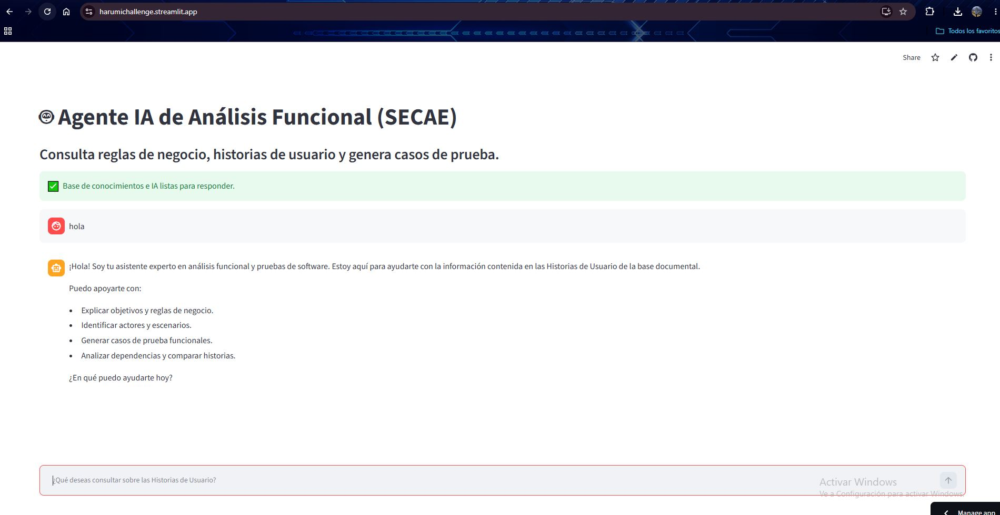
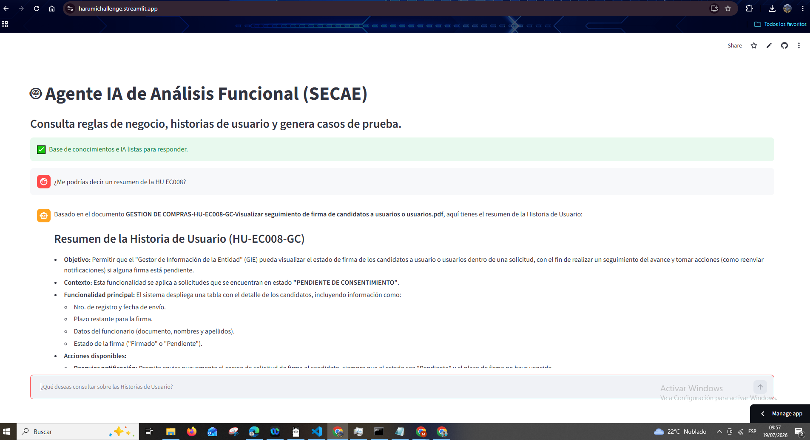

# 🤖 Proyecto Alura ONE:  Agente IA RAG para Análisis Funcional de Historias de Usuario 
> **Solución RAG (Retrieval-Augmented Generation) Local** para la consulta automatizada de reglas de negocio, historias de usuario y diseño de casos de prueba sobre la plataforma SECAE.
Link del video de evidencia: https://drive.google.com/file/d/1rY0gU5PzxinWRcqPlthmVxYiP4sfrzEc/view?usp=sharing
Link del despliegue: https://harumichallenge.streamlit.app/
----------------------------------------------------------------------------------------------------------------------------------------------------------------------------------------
## 📄 1. Descripción General
Este proyecto implementa un Agente de Inteligencia Artificial basado en la arquitectura Retrieval-Augmented Generation (RAG), diseñado para asistir en el análisis funcional de software mediante la consulta inteligente de Historias de Usuario (HU) almacenadas en formato PDF.

EEl sistema procesa automáticamente documentos en formato PDF, genera representaciones vectoriales utilizando modelos de embeddings de HuggingFace, almacena la información en una base vectorial FAISS y permite responder consultas en lenguaje natural utilizando modelos Gemini mediante Google AI.

Entre las capacidades del agente se encuentran:

- Resumir Historias de Usuario.
- Explicar reglas de negocio.
- Identificar actores.
- Identificar validaciones funcionales.
- Generar casos de prueba funcionales.
- Relacionar Historias de Usuario.
- Comparar Historias de Usuario.
- Generar casos de prueba funcionales con precondiciones, datos de prueba, pasos y resultados esperados.
- Analizar relaciones y dependencias entre Historias de Usuario.

Para facilitar el mantenimiento del repositorio, cada archivo cumple una función específica dentro del ecosistema:

*app.py: El núcleo de la aplicación. Implementa la interfaz web en Streamlit, carga el índice vectorial FAISS, inicializa el modelo Gemini mediante Google AI y ejecuta el flujo RAG para responder consultas en lenguaje natural.

*generar_indice.py: El script de preparación de datos. Lee los archivos de la carpeta PDF/, los fragmenta, genera los vectores e inicializa/reconstruye el índice vectorial local en vector_db/.

*requirements.txt: Archivo de gestión de dependencias que asegura que todas las librerías necesarias tengan las versiones exactas para su correcta replicación.

*.gitignore: Define los archivos que no deben rastrearse en GitHub (como bases de datos locales, entornos virtuales o documentos confidenciales).
----------------------------------------------------------------------------------------------------------------------------------------------------------------------------------------
## 🏗️ 2. Arquitectura de la Solución
El flujo de procesamiento de la información se divide en dos fases principales:

```text
            FASE 1
      INGESTA DE DOCUMENTOS

PDF
 │
 ▼
PyPDFLoader
 │
 ▼
RecursiveCharacterTextSplitter
 │
 ▼
Embeddings
(all-MiniLM-L6-v2)
 │
 ▼
FAISS
(vector_db)


            FASE 2
       CONSULTA DEL USUARIO

Usuario
 │
 ▼
Streamlit
 │
 ▼
Retriever
 │
 ▼
FAISS
 │
 ▼
Contexto
 │
 ▼
Prompt
 │
 ▼
Gemini API
 │
 ▼
Respuesta
----------------------------------------------------------------------------------------------------------------------------------------------------------------------------------------
## ⚙️ 3. Tecnologías y herramientas utilizadas
* Interfaz de Usuario: Streamlit

* Orquestación de IA: LangChain

* Modelo de Lenguaje (LLM): Google Gemini API (Gemini Flash)

* Generación de Embeddings: HuggingFace (all-MiniLM-L6-v2)

* Base de Datos Vectorial: FAISS

* Procesamiento de Documentos: PyPDF

* Lenguaje de programación: Python
----------------------------------------------------------------------------------------------------------------------------------------------------------------------------------------
## 🚀 4. Instrucciones para ejecutar el proyecto
###Prerrequisito del Sistema
    *Python 3.11+
    *Cuenta y API Key de Google AI Studio para utilizar Gemini API.
###Desplegar la aplicación
    1. Clonar el repositorio:
        git clone https://github.com/harumipereda/proyecto_alura_analisis_funcional
        cd proyecto_alura_analisis_funcional

    2. Crear entorno virtual:
        python -m venv env
        Activar entorno:
        env\Scripts\activate

    3. Instalar dependencias:
        pip install -r requirements.txt

    4. Configurar variables de entorno:
        Crear un archivo `.env`: GOOGLE_API_KEY=tu_api_key

    5. Generar la base vectorial:
        python generar_indice.py

    6. Ejecutar aplicación:
        streamlit run app.py
----------------------------------------------------------------------------------------------------------------------------------------------------------------------------------------
## 📝 5. Ejemplos de preguntas que el agente puede responder.
    *¿Me podrías decir un resumen de la HU EC008?
    *Genera 3 casos de prueba de HU EC008.
    *¿Quiénes son los actores de la HU EC008?
----------------------------------------------------------------------------------------------------------------------------------------------------------------------------------------
## 😊 6. Ejemplos de respuestas generadas por el agente.
    *La Historia de Usuario GESTION DE COMPRAS-HU-EC008-GC-Visualizar seguimiento de firma de candidatos a usuarios o usuarios tiene como objetivo principal permitir que el Gestor de Información de la Entidad (GIE) pueda monitorear el estado de las firmas de los candidatos a usuarios dentro de una solicitud.
    Aquí tienes un resumen de sus puntos clave:
    Propósito: Facilitar el seguimiento del avance en la firma del "Consentimiento para el Tratamiento de Datos Personales" para que el GIE pueda tomar acciones si hay firmas pendientes.
    Funcionalidad principal: El sistema despliega una tabla con el detalle de los candidatos, incluyendo información como el número de registro, fecha de envío, plazo restante para firmar, nombres, y el estado de la firma (Firmado/Pendiente).
    Acción de gestión: Se incluye un botón de "Reenviar notificación" para solicitar nuevamente la firma al candidato. Esta acción está sujeta a reglas específicas:
        Solo está habilitada si el estado de firma es "No" (Pendiente). 
        Solo está disponible si aún no ha vencido el plazo para el consentimiento.
    Reglas de negocio destacadas:
        Estado de la solicitud: El seguimiento solo está disponible para solicitudes que se encuentren en estado "PENDIENTE DE CONSENTIMIENTO".Restricciones de edición: No se permite visualizar ni editar datos de la solicitud desde esta vista de seguimiento (RN-04).Notificación: Al reenviar, el sistema envía un correo electrónico con el enlace para la firma (vía reconocimiento facial o firma digital) y advierte sobre el plazo máximo de vencimiento.
    Precondición: La solicitud debe haber sido enviada previamente.
    *Caso de prueba 1: Visualización correcta de la tabla de seguimiento
        Caso de prueba: Validar la carga de la información en la pantalla de seguimiento.
        Precondiciones: La solicitud debe estar en estado "PENDIENTE DE CONSENTIMIENTO".
        Datos de prueba: Solicitud con al menos un candidato a usuario registrado.
        Pasos:
            *Ingresar al sistema con el rol de Gestor de Información de la Entidad (GIE).
            *Seleccionar la opción para visualizar el seguimiento de firma de la solicitud.
            *Resultado esperado: El sistema muestra la tabla con los campos: Nro. de registro, Fecha de envío, Plazo restante, Texto informativo, Nro. de  documento, Nombres y apellidos, Firmado y las acciones disponibles, conforme a la Tabla 1 y la RN-07.
    *Basado en la Historia de Usuario GESTION DE COMPRAS-HU-EC008-GC-Visualizar seguimiento de firma de candidatos a usuarios o usuarios, los actores identificados son:
        Gestor de la Información de la Entidad (GIE): Es el actor principal que realiza la acción de visualizar el estado de firma de los candidatos a usuario para hacer seguimiento del avance y tomar acciones (como reenviar notificaciones).
        Candidato a usuario o usuario: Es la persona designada que debe firmar el consentimiento de la solicitud y sobre quien se realiza el seguimiento.
    Nota: El documento también menciona al "Evaluador OLCE" en el contexto del requerimiento RF-078, indicando que este rol también puede realizar la solicitud de alta de usuarios, aunque la historia de usuario se enfoca en el GIE para la visualización del seguimiento.
## 📸 7. Capturas de evidencia.

### Pantalla principal



### Consulta realizada



### Respuesta del agente


